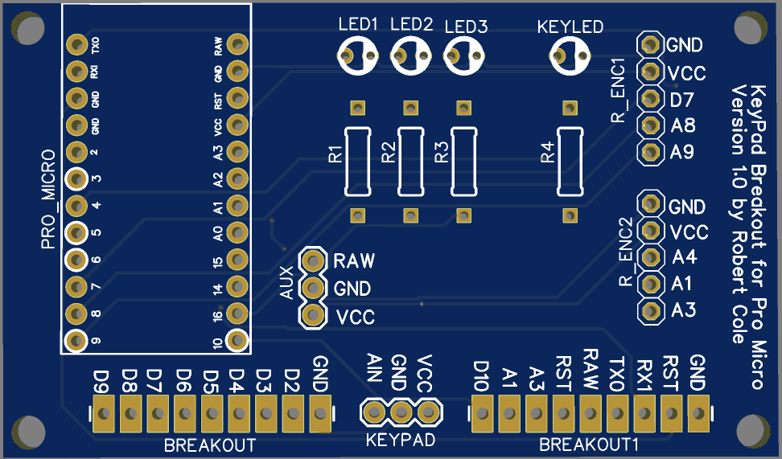
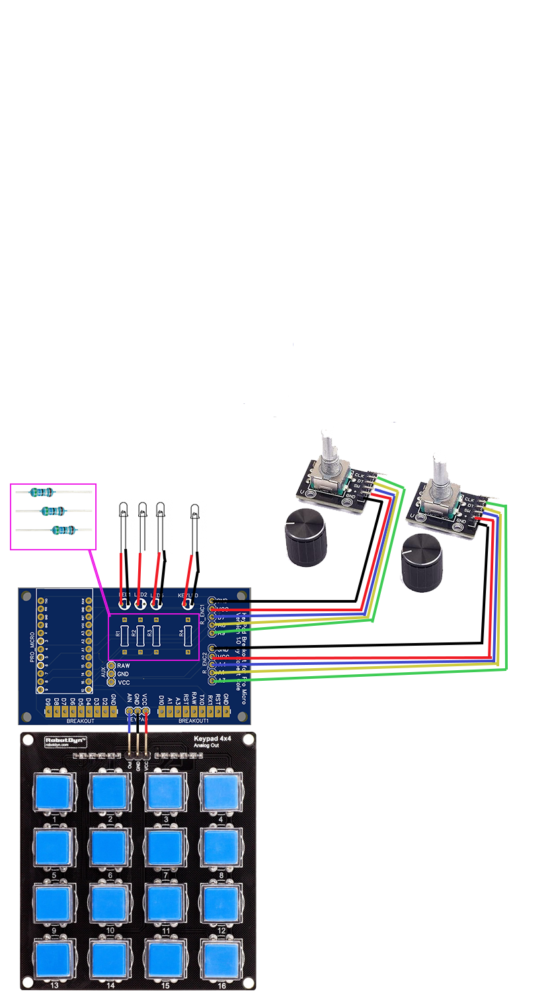

    
# KeyPad Breakout for Pro Micro and RobotDyn Keypad
## Required components:
- Arduino Pro Micro 32U Microcontroller.
- NicoHood's HID-Project Library for Arduino. [HID-Project](https://github.com/NicoHood/HID)
- RobotDyn 16 button 3-wire keypad. [RobotDyn 4x4 Keypad](https://www.banggood.com/5V-Button-Keypad-4x4-Module-Assembled-Keyboard-p-1645007.html)
- Keypad Breakout for Pro Micro ver1.0 by Robert.


## Optional (but recommended):
- One or Two Dual Encoders with presoldered resistors. [Amazon - Cylewet 5Pcs KY-040 Rotary Encoder Module with 15×16.5 mm with Knob Cap for Arduino](https://www.amazon.ca/dp/B07DFFSZ73/ref=cm_sw_em_r_mt_dp_GTFJT82QA5BB0PV9Z99V?_encoding=UTF8&psc=1)
- (4) 3mm LEDS. (I used white generic. Will determine resistors req'd).
- (4) 5.6ohm resistors. (or appropriate  for your LEDS).
- Male to Female Leads.
- 3D Printed Case. (or maybe a suitable wood case?).
- Printer / Printed labels for the keypad.
- (6) M3 Screws and Nuts. [Screws / Nuts / Standoffs](https://www.amazon.ca/gp/product/B06Y591NKK/ref=ppx_yo_dt_b_asin_title_o04_s01?ie=UTF8&psc=1)
- (2) M3 x 8mm Standoffs.

## Folder Structure
- **Arduino**, contains .INO for Arduino IDE. Requires HID-Project.h Library (GitHub) and Encoder.h (Library Manager in IDE)
- **EasyEDA**, contains .JSON files for EasyEDA to create PCB for the breakout board. Can be sent to board manufacturer.
- **Fusion360**, contains both .F3D and .STL files. The .F3D files can be changed to your neeeds. The .STL can be sent to a 3D printed if using the same components.
- **Images**, Self-explanatory.
- **KeyMap**, contains a text file with the default key mapping when using the configured settings in the .INO file for Arduino. I use it as a cheat sheet.
- **RobotDyn**, contains files for measurements and schematics for the keypad.
- **Schematics**, contains all the diagrams, pictures, and schematics of the project.

# Description
I wanted to turn a keypad into a functional macro keyboard. In order to maximize the use of the keyboard, I created a MODE button that allows up to 4 button layouts that can be toggled between. Using the HID-Project Library, the first mode focuses on common shortcuts, web broswers, and operating systems. MODES 2-4 focus on the use of F13-F24 keys not normally found on standard keyboards allowing unique bindings for different applications.

One of the best features is pairing this project with one or two Dual Encoders. I have programmed them by default as being one dedicated to Volume Up and Down with the press to Mute. The second encoder has been set to be a Zoom In and Out for web browsing with the press to Reset to 100%.

**Noteworthy code for the encoders:** 4x4-KeyPad-Multi.ino
```
// ENCODER SETUP
bool encoderOneEnable = true; // DEFAULT ENCODER on R_ENC1
bool encoderTwoEnable = true; // SECONDARY ENCODER on R_ENC2
```
*These settings will enable or disable the encoders.*


I also left many pin outs for possible future use or variations when designing the circuit board. As of version 1.0, I can say everything is working! However, like everything when prototyping, I should have chose my pins more wisely for the LEDs. It would have been nice to set a dimmer for them. Three of the LEDs display the Mode. All off is mode 1, left LED is mode 2, middle LED is mode 3, and the right LED is mode 4. They all stay on while in their respective mode. The fourth LED is a keypress confirmation. Briefly lights while the key is pressed, and turns off when released.



# Friendly Words
This is my first public project. I'm fairly new to creating content on GitHub. I have been programming for awhile. The project case I created using Fusion 360, and printed on an AnyCubic Mega Pro. The circuit board was created using EasyEDA. It was the first time I created a circuit board and had it printed via PCBWay as they do small batches for cheap at the time of writing this. Many thanks to snippets of code and hours of mistakes to get the code to where it is today from countless people I found on internet searches. NicoHood's HID-Project was the final touch required to make this project possible. Please leave me a comment if something is not right, or can be changed, or if I've done something wrong. Thanks!
